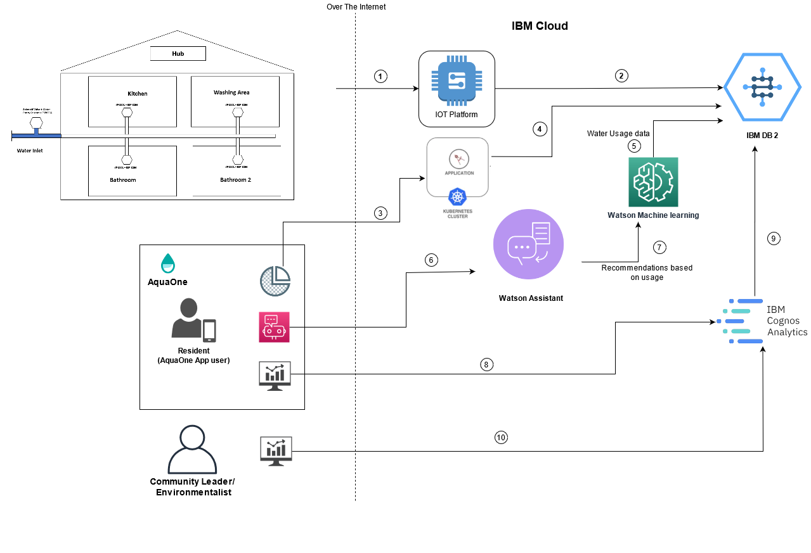

# Submission or project name
AquaSavious

## Contents

- [Submission or project name](#submission-or-project-name)
  - [Contents](#contents)
  - [Short description](#short-description)
    - [What's the problem?](#whats-the-problem)
    - [How can technology help?](#how-can-technology-help)
    - [The idea](#the-idea)
  - [Demo video](#demo-video)
  - [The architecture](#the-architecture)
  - [Long description](#long-description)
  - [Project roadmap](#project-roadmap)
  - [Getting started](#getting-started)
  - [Live demo](#live-demo)
  - [Built with](#built-with)
  - [Contributing](#contributing)
  - [Versioning](#versioning)
  - [Authors](#authors)
  - [License](#license)
  - [Acknowledgments](#acknowledgments)

## Short description

### What's the problem?

Water is the most essential, limited and invaluable resource available on earth. A drop of water is worth more than a sack of gold to a thirsty man. As the population is increasing the water needs are also increasing hence as a world citizen it is important for us to save water by all means. As a resident I should have access to all the water saving techniques and I should be motivated to do the same. To inculcate this habit technology can be used by providing all the required help and motivation to continue saving water by all means. To save water one needs to know their daily water consumption and then make a plan to reduce it consciously. You also need advice from experts to save water efficiently. Recycling used water is expensive but saving water at individual level is less expensive and contributes to more fresh water availability.

### How can technology help?

Residents can get to know their daily, monthly and yearly water consumption by using sensor based IOT devices. Residents can also interact with a chatbot that can provide all the required information like where the consumption is more, recommendations on how to save more water etc. Residents can also compete with each other through gamification dashboard where each saving will add to points their by encouraging resident to save more water. Residents can also interact with experts to gain more knowledge on water saving techniques. 

### The idea

Our idea promotes saving of water by allowing residents to view their water consumption using IOT devices. Residents can also track their progress through gamification dashboard which will show their position in water saving as compared to other residents. Residents can interact with a chatbot backed by IBM Watson Assistant that can provide all the required information like where the consumption is more, recommendations on how to save more water etc. Residents are  encoured to resolve leakages issues on priority. Residents can also interact with experts and capture photos and post of facebook for creating awareness about water saving. The IOT devices can also help get information on water purity.
Apart from above certain IOT device which stop the flow can be used to switch off supply from main inlets when residents are going on vacation. The vaction mode will save water incase residents forget to close taps when there was no supply and when supply resumes the water start overflowing causing a lot of wastage.
The main focus of our idea remains on helping each resident save as much water as they can by providing access to all the required information. The data collected from IOT devices is maintained in IBM cloud and Cognos is used to generate the required graphs for gamification.

## Demo video

## The architecture

1. The IoT devices send data to IBM IOT platform over the internet.
2. The IoT platform stores the data in IBM DB2
3. The AquaOne app calls the Application to get the water consumption of the user.
4. The water consumption data is fetched from IBM DB2 database
5. The IBM Watson machine learning is fed the data from DB2 database.
6. The user interacts with the chatbot that is supported by IBM Watson Assistant.
7. The IBM Watson Assistant gets the recommendations from IBM machine learning based on the water usage.
8. For my contribution towards water saving the graphs are fetched from IBM Cognos Analytics.
9. The Cognos Analytics creates reports by fetching data from DB2 database. 
10. Similarly a community leader or environmentalist can view the distribution data of all residents by fetching the analytics data from IBM Cognos Analytics.

## Long description

[More detail is available here](./docs/DESCRIPTION.md)

## Project roadmap
![Roadmap]
The prototype submitted does the following:
1. Allows user to view their water consumption on daily, monthly, yearly basis.
2. Show water distribution in various areas of home like kitchen, toilet, washing areas etc.
3. On selecting the areas the app provides general recommendations for saving more water.
4. The profile shows the badges earned by user based on the water saving done till date.
5. Based on badges the user earned points are shown and an option to redeem the same are shown.
6. The profile section provides an option for vacation mode which when turned on switches off the supply from main inlet their by saving water due to open or leaking taps.
7. My Contribution screen shows the user water savings in comparison to other users.
8. The purity option shows the water purity levels.
9. The IBM Assistant chatbot is integrated which provides recommendations.

Future Roadmap:
1. Connect the IOT devices to IOT platform.
2. A Node-RED workflow then sends the data to the IBM Watson-based machine learning model, which provides the recommendations based on water usage and that is displayed in the AquaOne dashboard.
3. Store all of the information in a Cloudant database, provide a historical view of the data. The service can be deployed in Kubernetes, inside the IBM Cloud Kubernetes Service and use websockets server with an NGINX web server to show the data in a comprehensive way. Any authenticated and authorized client that supports JavaScript and WebSockets can connect to the dashboard that shows the water utilization of residents who have subscribed to the AquaSaviour services.

Future Integrations:
   Integrate with weather service to predict the rainfail and generate predictions about required consumption per house and save water if rainfall is not going to be adequate.
   Provide area details where people consume water efficiently and water shortage is minimum.
   Provide rental flat data where water saving apps are provided and owner can view the water consumption.
   Set limit on daily water consumptions and support prepaid water availability.

## Getting started

- [chatbot](./chatbot/index.html)
- [angular_app](./angular_app/)

## Live demo

You can find a running chatbot to test at [AquinaAssitant](./chatbot/index.html).

## Built with

- [IBM Watson](https://cloud.ibm.com/catalog?search=cloudant#search_results) - The NoSQL database used
- [IBM Cloud Functions](https://cloud.ibm.com/catalog?search=cloud%20functions#search_results) - The compute platform for handing logic
- [IBM API Connect](https://cloud.ibm.com/catalog?search=api%20connect#search_results) - The web framework used
- [Dropwizard](http://www.dropwizard.io/1.0.2/docs/) - The web framework used
- [Maven](https://maven.apache.org/) - Dependency management
- [ROME](https://rometools.github.io/rome/) - Used to generate RSS Feeds

## Authors

- **Billie Thompson** - _Initial work_ - [PurpleBooth](https://github.com/PurpleBooth)

## License

This project is licensed under the Apache 2 License - see the [LICENSE](LICENSE) file for details.

## Acknowledgments

- Based on [Billie Thompson's README template](https://gist.github.com/PurpleBooth/109311bb0361f32d87a2).
